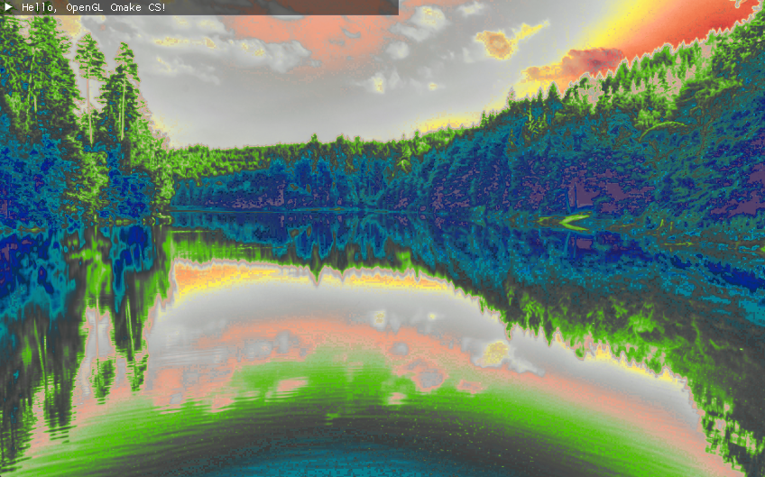

OpenGL CMake CS
=======================

This is a C++14 CMake project for OpenGL applications by CS. It includes the following libraries: **GLFW**, **Glew**, **glm**, and **assimp**. The project is designed to be cross-platform and can be compiled on  ***Linux***, ***Windows***, and ***Mac***.

Features:
- Ready-to-use C++14 CMake project for OpenGL applications
- Uses **GLFW**, **Glew**, **glm**, and **assimp** libraries
- Supports Linux, Windows, and Mac
- Includes a Shader class and an example Application

Functionality:
- Creates a simple OpenGL application with a window
- Loads and displays 3D models using assimp
- Load 3DLUT texture and render pseudo-color of image exposure
- Render zebra patterns of image exposure
- Render image waveform

Requirements:
- C++14 Compiler (GCC 4.8+, Clang 3.4+, MSVC 2015+)
- CMake 3.0+

<div style="display:flex;">
    
    
    
</div>

Clone the Repository (With Submodules):
========================

To clone the repository and its submodules, use the following command:
```
git clone --recursive https://github.com/CSsaan/OpenGL_CMake_CS.git
```

Alternatively, if you didn't use the `--recursive` option while cloning, you can initialize and update the submodules separately:
```bash
git submodule init
git submodule update
```

Usage for Linux:
---------------

Install the required libraries and follow these steps:
```bash
sudo apt-get install cmake libxrandr-dev libxinerama-dev libxcursor-dev libxi-dev libgl1-mesa-dev libglu1-mesa-dev
git clone --recursive https://github.com/CSsaan/OpenGL_CMake_CS.git
cd OpenGL_CMake_CS
mkdir build
cd build
cmake ..
make -j
./opengl-cmake-cs
```

Usage for Windows:
------------------

For Windows, you can use cmake-gui or follow these steps:
```bash
git clone --recursive https://github.com/CSsaan/OpenGL_CMake_CS.git
cd OpenGL_CMake_CS
mkdir build
cd build
cmake -G"MinGW Makefiles" ..  # (Compile with MinGW) | cmake .. (Default compilation for Visual Studio)
make -j
run opengl-cmake-cs.exe
```

Feel free to contribute and provide any comments or suggestions.